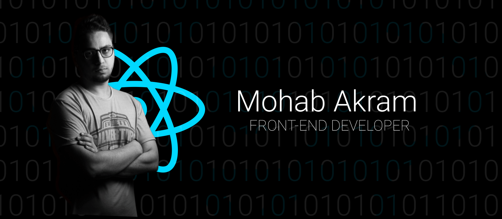

(https://www.upwork.com/freelancers/~019311866e360cc8ee)

### About me

<!-- BLOG-POST-LIST:START -->
Dedicated, helpful, and principled problem solver who can be relied on to envision, plan, and carry out complex projects for humanitarian causes.
<!-- BLOG-POST-LIST:END --> 

